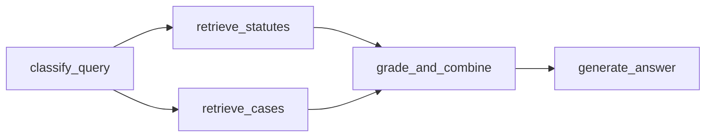

# AI Legal Advisor

AI Legal Advisor is a full-stack legal intelligence platform focused on Pakistani cyber law workflows.  
It combines Graph RAG over statutes and case law, Flask APIs for analysis/drafting/search, and a React + Vite interface for legal research, workspace analysis, and complaint/petition drafting support.

This README is the primary source of truth for the current repository state.

## Table of Contents

- [1) What This Project Does](#1-what-this-project-does)
- [2) Current Architecture](#2-current-architecture)
- [3) Repository Layout](#3-repository-layout)
- [4) Backend Deep Dive](#4-backend-deep-dive)
- [5) Frontend Deep Dive](#5-frontend-deep-dive)
- [6) Data Assets and Contracts](#6-data-assets-and-contracts)
- [7) Ingestion, Parsing, and Scraping Pipelines](#7-ingestion-parsing-and-scraping-pipelines)
- [8) Benchmark and Evaluation Workflow](#8-benchmark-and-evaluation-workflow)
- [9) API Reference (Current Routes)](#9-api-reference-current-routes)
- [10) Local Development Setup](#10-local-development-setup)
- [11) Validation and Smoke Checks](#11-validation-and-smoke-checks)
- [12) Known Gaps and Active Cleanup Areas](#12-known-gaps-and-active-cleanup-areas)
- [13) Security and Operational Notes](#13-security-and-operational-notes)
- [14) Contribution Rules](#14-contribution-rules)
- [15) FAQ / Troubleshooting](#15-faq--troubleshooting)
- [16) End-to-end technical approach (JSON → graph → retrieval → UI)](#16-end-to-end-technical-approach-json--graph--retrieval--ui)

## 1) What This Project Does

The system supports two primary user workflows:

1. **Legal Q&A and retrieval**
   - Accepts a legal question.
   - Retrieves statutes + related case law from Neo4j.
   - Produces grounded responses with cited sources.

2. **Workspace-guided legal analysis**
   - Accepts case narrative, optional OCR evidence, and incident date.
   - Returns:
     - legal summary,
     - applicable laws,
     - related precedents,
     - evidence checklist,
     - heuristic win-probability estimate.
   - Supports downstream draft generation for petitions and NCCIA complaints.

## 2) Current Architecture

### High-level flow

1. React frontend sends requests to `/api/*`.
2. Flask API in `backend/app/api/routes.py` handles auth, query, OCR, analysis, drafting, search, and metadata endpoints.
3. Query/analysis endpoints use:
   - `backend/app/graph_rag/legal_graph_rag.py` for retrieval + generation logic.
   - `backend/app/graph_rag/graph.py` (LangGraph workflow) for orchestrated processing.
4. Neo4j stores statutes, cases, concepts, and graph relationships.
5. Optional MongoDB persists users/sessions/conversations/workspace state.
6. LLM generation is performed via Ollama-compatible endpoint configured by `OLLAMA_URL`.

### Core backend modules

- `backend/run.py`: backend runtime entrypoint.
- `backend/app/api/routes.py`: all Flask routes.
- `backend/app/graph_rag/legal_graph_rag.py`: retrieval/search/generation core.
- `backend/app/graph_rag/graph.py`: LangGraph orchestration graph.
- `backend/app/graph_rag/legal_graph_builder.py`: graph ingestion/build logic.
- `backend/app/graph_rag/query_classifier.py`: query complexity classification.
- `backend/app/graph_rag/state.py`: workflow state schema.

### Core frontend modules

- `frontend/src/main.tsx`: app bootstrap.
- `frontend/src/App.tsx`: route definitions.
- `frontend/src/layout/Layout.tsx`: shared app shell.
- `frontend/src/pages/Workspace.tsx`: guided analysis workspace.
- `frontend/src/pages/Chat.tsx`: legal assistant chat.
- `frontend/src/pages/Cases.tsx`: case browser.
- `frontend/src/pages/Documents.tsx`: statute document viewer.

## 3) Repository Layout

```text
AILegalAdvisor/
├── AGENTS.md
├── README.md
├── docs/
│   └── research_papers/
├── backend/
│   ├── AGENTS.md
│   ├── pyproject.toml
│   ├── uv.lock
│   ├── run.py
│   ├── docker-compose.yaml
│   ├── app/
│   │   ├── api/
│   │   │   └── routes.py
│   │   ├── graph_rag/
│   │   └── utils/
│   ├── data/
│   │   ├── jsons/
│   │   ├── generated/
│   │   └── pdfs/
│   ├── scripts/
│   │   ├── ingestion/
│   │   ├── parsers/
│   │   └── scrapers/
│   └── tests/
└── frontend/
    ├── AGENTS.md
    ├── package.json
    ├── vite.config.ts
    ├── .env.example
    └── src/
```

## 4) Backend Deep Dive

### Runtime and app initialization

- Start command: `python run.py` from `backend/`.
- Flask app is created in `backend/app/api/routes.py`.
- CORS is enabled globally.
- LangGraph app initializes at backend startup via `create_legal_graph()`.

### Data backends and persistence

- **Neo4j**: required for graph retrieval/search.
- **MongoDB**: optional; if unavailable, app falls back to in-memory session history for some features.
- **Filesystem PDFs**: served from `backend/data/pdfs` via `/api/pdf`.

### Retrieval/generation behavior

- Main query endpoint (`/api/query`) supports:
  - greeting short-circuit,
  - LangGraph orchestration path (`use_orchestrator: true`, default),
  - fallback direct `rag_system.query(...)`.
- Response typically includes:
  - answer,
  - statute sources,
  - case references,
  - complexity + strategy metadata.

### Drafting behavior

- `/api/draft/petition` and `/api/draft/nccia` generate markdown draft text from narrative + retrieved context.
- Prompt templates are selected by `template_id`.

### OCR behavior

- `/api/ingest/ocr` accepts uploaded files.
- PDF extraction uses `pdfplumber`.
- Image extraction defaults to EasyOCR, with optional Tesseract fallback.

### Backend dependencies (declared in `backend/pyproject.toml`)

Major libraries:
- Flask, Flask-CORS
- Neo4j driver
- sentence-transformers, spaCy, langgraph
- pymongo
- pdfplumber, Pillow, pytesseract, easyocr
- selenium, webdriver-manager, beautifulsoup4
- requests, python-dotenv
- google-generativeai, json-repair

## 5) Frontend Deep Dive

### Stack and tooling

- React 19 + TypeScript + Vite 7
- Tailwind CSS v4
- React Router
- Framer Motion + 3D graph stack (`three`, `@react-three/fiber`, `@react-three/drei`)
- ESLint flat config + TypeScript strict compiler options

### Routing model (`frontend/src/App.tsx`)

Public auth routes:
- `/login`
- `/register`
- `/forgot-password`

App routes (inside shared layout):
- `/` -> Workspace
- `/chat`
- `/documents`
- `/cases`
- `/profile` (protected)
- `/settings/email` (protected)

### API integration model

- `frontend/src/lib/apiBase.ts` centralizes API URL handling.
- In dev, frontend uses same-origin `/api/*` with Vite proxy.
- In production builds, `VITE_API_BASE_URL` is used to prefix API requests.

### Dev proxy and PDF middleware (`frontend/vite.config.ts`)

- `/api` proxied to `VITE_DEV_BACKEND_PROXY` or default `http://127.0.0.1:5000`.
- Vite middleware serves local PDFs from `backend/data/pdfs` at `/pdfs/*` for document viewing in frontend.

## 6) Data Assets and Contracts

### Contracted data layout (backend AGENTS policy)

- Canonical statutes: `backend/data/jsons/`
- Canonical court datasets: `backend/data/jsons/cyber_cases/`
- Generated datasets/artifacts: `backend/data/generated/`
- Benchmark/evaluation outputs: `backend/tests/evaluation_results/`

### Ingestion source file list

- Source of truth for statute ingest inputs:
  - `backend/scripts/ingestion/file_paths.json`

Current listed files:
- `constitution-1973.json`
- `electronic-transactions-ordinance-2002.json`
- `pakistan-penal-code.json`
- `peca-act-2016.json`
- `peca-amendment-2025.json`
- `pakistan-telecom-rules-2000.json`

### Naming conventions in current codebase

- Prefer lowercase kebab-case for new dataset files.
- Court naming pattern currently used:
  - `lahore-high-court-cyber-cases.json`
  - `islamabad-high-court-cyber-cases.json`
  - `peshawar-high-court-cyber-cases.json`
  - `sindh-high-court-cyber-cases-<year>.json`

## 7) Ingestion, Parsing, and Scraping Pipelines

### Ingestion scripts

- `backend/scripts/ingestion/ingest_data.py`
  - Creates constraints/indexes and ingests statute JSON inputs from `file_paths.json`.
- `backend/scripts/ingestion/ingest_cases.py`
  - Ingests cyber case datasets and builds case nodes/relationships.
- `backend/scripts/ingestion/generate_file_paths.py`
  - Utility for maintaining ingestion path manifest.

Sub-scripts in `backend/scripts/ingestion/sub_scripts/`:
- `create_similarities.py`
- `create_case_similarities.py`
- `create_citations.py`
- `update_concepts.py`
- `ingest_single_file.py`

### Parser scripts

Located in `backend/scripts/parsers/`:
- `constitution_parser.py`
- `eto_2002_parser.py`
- `pak_telecom_rules_2000_parser.py`
- `peca_2016_parser.py`
- `peca_act_parser.py`
- `ppc-parsing.py`
- `batch_federal_laws_parser.py`

### Scraper and enrichment scripts

Located in `backend/scripts/scrapers/`:
- `lhc_scraping.py`
- `phc_scraper.py`
- `shc_caselaw_scraper.py`
- `shc_cyber_pdf_scanner.py`
- `ihc_scrapper.py`
- `ihc_pdf_extractor.py`
- `extract_case_pdfs.py`
- `enrich_combined_cases.py`
- `cyber_law_filter.py`
- `federal_laws_scraper.py`

## 8) Benchmark and Evaluation Workflow

### Dataset generation

- `backend/scripts/generate_finetuning_dataset.py`
  - Builds finetuning dataset from statute/case sources.
- `backend/scripts/generate_benchmark_dataset.py`
  - Builds benchmark dataset from finetuning dataset.

### Evaluation

- `backend/tests/evaluate_benchmark.py`
  - Runs retrieval/generation evaluation against benchmark inputs.
  - Writes reports under `backend/tests/evaluation_results/`.

## 9) API Reference (Current Routes)

Base URL (local): `http://127.0.0.1:5000`

### Health and reachability

- `GET /health`
- `GET /api/ping`

### Auth and account

- `POST /api/auth/register`
- `POST /api/auth/login`
- `POST /api/auth/logout`
- `POST /api/auth/reset-password`
- `POST /api/auth/update-email`

### User workspace persistence

- `GET /api/user-data/<user_id>`
- `PUT /api/user-data/<user_id>`

### Legal assistant and history

- `POST /api/query`
- `GET /api/history/<session_id>`
- `DELETE /api/history/<session_id>`

### OCR, analysis, drafting

- `POST /api/ingest/ocr`
- `POST /api/workspace/analyze`
- `POST /api/draft/petition`
- `POST /api/draft/nccia`

### Retrieval/search/graph data

- `POST /api/search/semantic`
- `POST /api/search/keyword`
- `GET /api/article/<path:article_id>/related`
- `GET /api/stats`
- `GET /api/documents`
- `GET /api/cases`
- `GET /api/concepts`

### PDF endpoints

- `GET /api/pdf`
- `GET /api/pdf/info`

## 10) Local Development Setup

### Prerequisites

- Python `>=3.12`
- Node.js `>=18`
- Neo4j running locally (`bolt://localhost:7687` typical)
- Optional MongoDB connection string for auth/session persistence
- Ollama-compatible generation endpoint reachable from backend

### 1) Backend setup

```bash
cd backend
python -m venv .venv
```

Activate environment:

- Windows PowerShell:
```powershell
.venv\Scripts\Activate.ps1
```

- macOS/Linux:
```bash
source .venv/bin/activate
```

Install dependencies (recommended via `uv`):

```bash
uv sync
```

Create env file:

```bash
cp .env.example .env
```

Set required values in `.env`:
- `NEO4J_URI`
- `NEO4J_USER`
- `NEO4J_PASSWORD`
- `OLLAMA_URL`
- `OLLAMA_MODEL`

Optional:
- `MONGO_URI`, `MONGO_DB_NAME`
- OCR tuning values (`OCR_ENGINE`, `OCR_FALLBACK_TESSERACT`, `EASYOCR_LANGS`, `EASYOCR_GPU`)
- benchmark/dataset generation vars (`GEMINI_API_KEY`, `GEMINI_MODEL`, `FINETUNE_*`)

### 2) Start Neo4j (optional docker compose path)

From `backend/`:

```bash
docker compose up -d
```

This compose currently provisions Neo4j only.

### 3) Ingest data into Neo4j

From `backend/`:

```bash
python scripts/ingestion/ingest_data.py
python scripts/ingestion/ingest_cases.py
```

### 4) Start backend API

From `backend/`:

```bash
python run.py
```

Health check:

```bash
curl http://127.0.0.1:5000/health
```

### 5) Start frontend

```bash
cd frontend
npm install
npm run dev
```

Frontend dev server defaults to Vite port (typically `5173` unless changed).

## 11) Validation and Smoke Checks

### Backend validation

From `backend/`:

```bash
python tests/evaluate_benchmark.py
```

Basic API smoke:

```bash
curl http://127.0.0.1:5000/health
curl http://127.0.0.1:5000/api/ping
```

### Frontend validation

From `frontend/`:

```bash
npm run lint
npm run build
```

## 12) Known Gaps and Active Cleanup Areas

These are current, practical repo realities:

- Dependency hygiene follow-up likely needed (some libs appear underused; some imported libs may need explicit declaration checks).

## 13) Security and Operational Notes

- Do not commit secrets from `.env`.
- Keep `.env.example` as non-secret template only.
- API includes file-serving endpoints (`/api/pdf`); path traversal protections are implemented, but treat filesystem exposure carefully.
- OCR upload endpoints process user files; enforce deployment-side limits (body size, rate limits, auth) before production internet exposure.
- Auth/session handling is custom and lightweight; production deployments should include hardened auth, token policy, and secure password handling lifecycle.

## 14) Contribution Rules

Project-specific agent/process rules are documented in:

- `AGENTS.md` (global)
- `backend/AGENTS.md`
- `frontend/AGENTS.md`

Important enforced conventions:

- Keep backend paths deterministic and relative (no machine-specific absolute paths).
- Keep naming in kebab-case for new datasets.
- Update references when files move/rename.
- Run relevant validation checks for touched areas:
  - backend changes: API/script/benchmark smoke.
  - frontend changes: `npm run build` and/or `npm run lint`.

## 15) FAQ / Troubleshooting

### Backend cannot connect to Neo4j

Check:
- Neo4j is running.
- `NEO4J_URI`, `NEO4J_USER`, `NEO4J_PASSWORD` are correct.
- Bolt port is reachable (`7687` by default).

### Backend starts but query responses fail

Check:
- `OLLAMA_URL` points to reachable generation backend.
- `OLLAMA_MODEL` exists on target backend.
- `/health` response includes generation service connectivity details.

### Login fails unexpectedly

Current behavior:
- Login requires MongoDB (`MONGO_URI`) because credentials are persisted in Mongo collection(s).
- If MongoDB is unavailable, auth routes that require user lookup/persistence will fail.

### Frontend cannot hit backend APIs in dev

Check:
- Backend running on `http://127.0.0.1:5000` (or override with `VITE_DEV_BACKEND_PROXY`).
- Vite server was restarted after env changes.
- Browser requests are sent to `/api/*` (proxy path), not hardcoded host paths.

### PDF links appear broken

Check:
- Files exist in `backend/data/pdfs`.
- API links use `/api/pdf?file=<filename>`.
- For document page UI, Vite middleware also serves `/pdfs/*` from the same backend data directory.

## 16) End-to-end technical approach (JSON → graph → retrieval → UI)

This section documents the **actual implementation**: how structured law/case data is produced, loaded into Neo4j, linked, queried, and exposed to the React app. It is written to match the code paths in `backend/app/graph_rag/`, `backend/scripts/`, and `frontend/src/`.

### 16.1 How canonical statute JSON is produced

Statute JSON files under `backend/data/jsons/` are the **ingestion source of truth** for acts/ordinances/rules listed in `backend/scripts/ingestion/file_paths.json`. They are not hand-written blobs; they are produced by **parser scripts** that read PDFs (or other inputs) and emit a normalized tree.

**Parser scripts** (representative list; all live under `backend/scripts/parsers/`):

| Output JSON (typical) | Parser script |
|----------------------|---------------|
| `constitution-1973.json` | `constitution_parser.py` |
| `peca-act-2016.json` | `peca_2016_parser.py` / `peca_act_parser.py` (legacy naming in repo) |
| `peca-amendment-2025.json` | amendment-oriented parser in same family |
| `electronic-transactions-ordinance-2002.json` | `eto_2002_parser.py` |
| `pakistan-telecom-rules-2000.json` | `pak_telecom_rules_2000_parser.py` |
| `pakistan-penal-code.json` | `ppc-parsing.py` |
| Batch federal laws | `batch_federal_laws_parser.py` |

**Design intent of parser output:** each file wraps a top-level object with a `document` key. That object carries metadata (`title`, `year`, optional `source_file` pointing at a PDF in `backend/data/pdfs/`) plus either:

- **`articles`**: list of provisions using `article_number`, `title`, `content`, optional `page_number`, `part`, `chapter`, and nested `clauses`, or
- **`sections`**: same idea but keyed as `section_number` in JSON; the builder normalizes these to a uniform internal shape.

**Clause nesting:** each clause has an `id` and `text`. Sub-clauses may appear under `clauses` or `sub_clauses`; `LegalGraphBuilder._process_clause` accepts both.

**Relationship to PDFs:** `source_file` on the `Document` node is used later by the API to build `pdf_link` URLs for the frontend (`/api/pdf?file=...` with optional `#page=` and `search=` fragments).

### 16.2 How court case JSON is produced

Case JSON under `backend/data/jsons/cyber_cases/` (and combined/enriched artifacts under `backend/data/generated/`) comes from a **scrape → normalize → optionally enrich** pipeline:

1. **Scrapers** (`backend/scripts/scrapers/`) pull judgment metadata (and sometimes PDF links) from high court sites—e.g. `lhc_scraping.py`, `phc_scraper.py`, `shc_caselaw_scraper.py`, `shc_cyber_pdf_scanner.py`, `ihc_scrapper.py`, etc.
2. **Cyber relevance filtering** uses helpers such as `cyber_law_filter.py` so datasets can be scoped to cyber-law-related matters where applicable.
3. **PDF extraction** (`extract_case_pdfs.py`, `ihc_pdf_extractor.py`) may download or read judgment PDFs and attach **`pdf_data`** (extracted text) and derived fields like **`winner`** to case records in JSON.
4. **Combined datasets** (`enrich_combined_cases.py`) can merge or enrich multiple court files into artifacts such as `all_courts_cyber_cases_enriched.json` for benchmarking or fallback listing.

**Per-court JSON shapes:** `ingest_cases.py` accepts:

- A **bare JSON array** of case objects, or
- A **wrapped** object with `judgments`, `cases`, `data`, or `results` holding the array.

LHC historically used `{"judgments": [...]}`; other courts often use a bare list.

**Normalization:** `CourtCaseIngester` maps each court’s raw fields into a **common internal dict** (`_norm_lhc`, `_norm_ihc`, `_norm_phc`, `_norm_shc`) with keys: `case_id`, `citation`, `title`, `case_no`, `date`, `judge`, `pdf_link`, `summary`, `discussed_laws`, cyber metadata (`cyber_law_reason`, filter profile, triggers JSON), `pdf_data`, `winner`, etc.

### 16.3 Neo4j schema: nodes, properties, and indexes

**Node labels**

| Label | Role |
|-------|------|
| `Document` | One row per statute/instrument (title is the merge key). |
| `Article` | One node per section/article provision; holds text, number, embedding, document linkage. |
| `Clause` / `SubClause` | Optional sub-structure under an article. |
| `Concept` | Tags/themes extracted from article text (taxonomy + NLP). |
| `Case` | Court judgment record with summary, optional full PDF text, embedding, court metadata. |

**Statute-side constraints and indexes** (`LegalGraphBuilder.create_constraints_and_indexes`):

- Uniqueness: `Document.title`, `Article.id`, `Clause.id`, `SubClause.id`, `Concept.name`.
- Full-text: `article_content` on `Article.content`, `clause_content` on `Clause.text`.
- Vector: **`article_embeddings`** on `Article.embedding` — **384 dimensions**, cosine similarity, model **`all-MiniLM-L6-v2`** (same family as `SentenceTransformer` in code).

**Case-side schema** (`CourtCaseIngester.create_case_schema`):

- Uniqueness: `Case.id` (citation is **not** forced unique—multiple cases may have empty citation).
- Full-text: **`case_title`** on `Case.title` and `Case.summary`.
- Vector: **`case_embeddings`** on `Case.embedding` — same 384-d cosine setup as articles.

### 16.4 Statute ingestion: `ingest_data.py` and `LegalGraphBuilder.ingest_document`

**Orchestrator:** `backend/scripts/ingestion/ingest_data.py`

1. **Step 1 — Constraints/indexes:** calls `builder.create_constraints_and_indexes()`.
2. **Step 2 — Document load:** reads paths from `file_paths.json` (relative to backend root); for each JSON file calls `builder.ingest_document(path)`.
3. **Step 3 — Article similarity:** runs subprocess `sub_scripts/create_similarities.py` with `--recreate --threshold 0.7` (parallel numpy + batch `SIMILAR_TO` inserts).
4. **Step 4 — Citation graph:** runs `sub_scripts/create_citations.py --recreate` (batch reference extraction + `CITES` + `RELATED_THROUGH`).
5. **Step 5 — Optional concept refresh:** interactive prompt; may run in-process `update_concepts()` to re-extract `Concept` nodes and `RELATES_TO` edges using the enhanced `extract_concepts` path.

**Per-document ingest** (`ingest_document`):

1. Load JSON; read `data['document']`.
2. `MERGE (d:Document {title})` and set `year`, `type` (derived from title via `_DOCUMENT_TYPE_MAP` / heuristic), `source_file`, `created_at`.
3. `_get_articles` selects `articles` or normalizes `sections` so every item has `article_number`, `title`, `content`, structural fields, and `clauses`.
4. For each provision:
   - Compute **embedding** of `content` with `SentenceTransformer('all-MiniLM-L6-v2')`.
   - Run **concept extraction** (`extract_concepts`): legal taxonomy keyword hits, spaCy NER (`LAW`, `ORG`, `GPE`, `EVENT`), filtered noun phrases; cap and rank.
   - Run **reference extraction** (`extract_references`) for inline citations (section/article/clause/order patterns).
   - `MERGE (a:Article {id})` where `id = f"{doc_title}:Article:{article_number}"` — note `doc_title` here is the **document node title string** passed as `doc_id` from `_create_document_node`.
   - Set `embedding`, metadata, `MERGE (d)-[:CONTAINS]->(a)`.
   - For each concept: `MERGE (c:Concept)` and `MERGE (a)-[:RELATES_TO]->(c)`.
   - For each clause: `MERGE (Clause)` and `MERGE (a)-[:CONTAINS]->(c)`; recurse sub-clauses.

### 16.5 Relationship types: how they are created and what they mean

| Relationship | Created by | Semantics |
|--------------|------------|-----------|
| `(Document)-[:CONTAINS]->(Article)` | Statute ingest | Document comprises provisions. |
| `(Article)-[:CONTAINS]->(Clause)-[:CONTAINS]->(SubClause)` | Statute ingest | Hierarchical text structure. |
| `(Article)-[:RELATES_TO]->(Concept)` | Ingest + optional `update_concepts` | Thematic tagging for browsing and graph expansion. |
| `(Article)-[:SIMILAR_TO]->(Article)` | `create_similarities.py` / builder helper | Cosine similarity on embeddings ≥ threshold; property `similarity`. |
| `(Article)-[:CITES]->(Article)` | `create_citations.py` / `build_citation_network` | Source article text references target provision number; properties `context`, `reference_type`. |
| `(Article)-[:RELATED_THROUGH]->(Article)` | Citation post-pass | Two articles cite **≥2** common intermediaries (shared citation hubs). Property `shared_citations`. |
| `(Case)-[:CITES]->(Article)` | `ingest_case` + `link_cases_to_articles_advanced` | Case text (PDF/summary) matched to `Article.article_number` via regex patterns; edge properties `provision`, `source` (`extracted` vs `advanced`). |
| `(Case)-[:SIMILAR_TO]-(Case)` | `create_case_similarities` in `ingest_cases` | Undirected pattern in Cypher with `MERGE (c1)-[r:SIMILAR_TO]-(c2)`; property `score`. |

**Article–article citation resolution:** when building `CITES`, the builder prefers **same-document** `(doc_title, article_number)` lookup, then falls back to **any** article with that number across the corpus (first match)—documented in code comments to reduce ambiguity.

**Case–article linking:** `extract_citations` on case text uses patterns like `Section N`, `Article N`, `N PPC`, `PECA N`, etc., producing provision strings; Cypher matches `Article` where `article_number` equals or contains the token.

### 16.6 Case ingestion: `ingest_cases.py` in detail

**Entry:** `python scripts/ingestion/ingest_cases.py` (optional `--dir`, `--file`, `--court`, `--keep-cases`).

**Flow:**

1. Instantiate `LegalGraphBuilder` with Neo4j env credentials.
2. `create_case_schema()` ensures `Case` constraints and `case_embeddings` / `case_title` indexes exist.
3. Scan `backend/data/jsons/cyber_cases/` (or custom dir) for `.json` files; infer **court** from filename (`lahore-high-court-...`, `ihc` prefix, etc.).
4. For each raw record, normalize with the court-specific function.
5. **`ingest_case`**:
   - Build **embedding text**: prefer first ~3000 chars of `pdf_data` prefixed with title if PDF text exists and is not an `[ERROR...]` placeholder; else title + summary.
   - `MERGE (c:Case {id})` and set all scalar properties and `embedding`.
   - Extract citations from concatenated title, case number, PDF excerpt (or summary), and `discussed_laws`; for each resolved article, `MERGE (c)-[:CITES]->(a)`.
6. Optionally **multiprocessing similarity** over all `Case` embeddings (`create_case_similarity_relationships`) to create `SIMILAR_TO` edges above a cosine threshold.
7. Optional second pass **`link_cases_to_articles_advanced`** adds `CITES` edges missed in the first pass (only where not already linked).

### 16.7 Retrieval stack: `LegalGraphRAG`

**Models**

- **Embeddings:** `SentenceTransformer('all-MiniLM-L6-v2')` — 384-d vectors stored on `Article.embedding` and `Case.embedding`, queried via `db.index.vector.queryNodes`.
- **Reranker:** `CrossEncoder('cross-encoder/ms-marco-MiniLM-L-6-v2')` when load succeeds; otherwise reranking is skipped (`use_reranker = False`).

**Primitive retrieval methods**

- **`semantic_search`:** embed query → `CALL db.index.vector.queryNodes('article_embeddings', ...)` → returns articles with cosine `score` as `similarity`, joined to parent `Document` for `document_title` and `source_file`.
- **`keyword_search`:** `CALL db.index.fulltext.queryNodes('article_content', $query)` → Lucene full-text score.
- **`case_semantic_search` / `case_keyword_search`:** same pattern on `case_embeddings` and `case_title`.
- **`get_related_articles`:** variable-length path `(Article)-[:SIMILAR_TO|RELATES_TO|CITES|RELATED_THROUGH*1..depth]->(Article)` — graph expansion for related provisions.
- **`get_cases_citing_article`:** `(Case)-[:CITES]->(Article)` for precedent lookup tied to a statute node.

**`multi_stage_retrieval` (broad recall used by direct `rag_system.query` path):**

1. **Stage 1 — Recall:** merge semantic + keyword articles; semantic + keyword cases; expand top semantic hits via `get_related_articles`; pull cases citing top articles; merge into a dict keyed by `id` with `type` `article` or `case` and multi-signal scores (`semantic_score`, `keyword_score`, `graph_score`, `case_score`).
2. **Combined score:** different linear weights for cases vs articles.
3. **Stage 2 — Cross-encoder:** build `(query, doc_text)` pairs (for cases, prefer `pdf_data` snippet else summary); predict logits, sigmoid-normalize, blend with `0.3 * combined + 0.7 * rerank`; drop below **0.20** `final_score`; return top_k.

**`rerank` helper:** used by LangGraph’s `grade_and_combine` with the same threshold logic; **case list fallback** if reranker wipes all cases (narrative vs judgment length mismatch)—sorts by vector/keyword score and sets `final_score` for UI.

**Other retrieval utilities in the same class (available for future routes or experimentation):** `hyde_retrieval`, `hybrid_search`, `extract_relevant_clauses` (clause-level embedding similarity), etc.

### 16.8 LangGraph orchestration: `graph.py` + `state.py`

**State** (`GraphState` in `state.py`): `question`, `complexity`, `statutes`, `cases`, `documents`, `answer`, `steps` (reducer append), `is_satisfactory`.

**Workflow** (`create_legal_graph`):



- **`classify_query`:** `QueryComplexityClassifier` — regex for explicit section/article references → `simple`; complexity indicators + length → `complex` / `moderate`.
- **`retrieve_statutes`:** parallel semantic + keyword `top_k` (10 if complex else 5); merge; boost if in both channels; sort; keep `top_k+5`.
- **`retrieve_cases`:** `case_semantic_search` + `case_keyword_search`, dedupe.
- **`grade_and_combine`:** dedupe, **`rerank`** statutes and cases separately (threshold 0.20), case fallback described above, set `documents = statutes + cases`.
- **`generate_answer`:** if empty docs, return guidance string; else `build_context(documents, max_words=2000)` then `generate_answer_ollama(..., response_format="json")`; parse JSON to set `is_satisfactory` heuristics.

**API wiring:** `routes.py` builds `legal_graph_app` at import time. `/api/query` and `/api/workspace/analyze` invoke `legal_graph_app.invoke(initial_state, config={"configurable": {"rag": rag_system}})`.

### 16.9 Generation: Ollama-compatible HTTP and response shaping

**Configuration:** `OLLAMA_URL` must be the **origin only** (code strips accidental `/api/tags` or `/api/generate` suffixes). `OLLAMA_MODEL` names the model. `OLLAMA_REQUEST_TIMEOUT` defaults to 300s for cold remote GPUs.

**Request:** `POST {OLLAMA_URL}/api/generate` with JSON `model`, `prompt`, `stream: false`, `options` (`temperature`, `num_predict`, `top_p`). Optional header `ngrok-skip-browser-warning` for free ngrok.

**Health:** `check_generation_health` probes `/api/tags`.

**Advisory JSON:** LangGraph generation path requests **`response_format="json"`** so the model is steered toward structured legal-advisor output; the API may return this string to the client; `routes.format_graph_response` maps graph output statutes/cases to `sources` / `cases` with `pdf_link` fragments.

**Draft endpoints:** `_draft_document` builds a text context block from narrative + laws + cases and calls `generate_answer_ollama` with **`response_format="text"`** for markdown-style petitions/complaints.

### 16.10 Flask API layer: request/response conventions

**`/api/query`**

- Body: `question`, optional `session_id`, `use_orchestrator` (default true).
- Greeting short-circuit returns fixed welcome with empty sources.
- On success: persists turn into conversation history (Mongo if available, else memory) with `sources`, `cases`, `duration`.
- Response keys include `answer`, `sources`, `cases`, `session_id`, `duration`, `complexity`, `retrieval_strategy`, `orchestrator`, `metadata`.

**`/api/workspace/analyze`**

- Body: `narrative`, optional `ocr_text`, `incident_date`, `session_id`.
- Runs same LangGraph pipeline with `narrative` as `question`; then merges OCR + narrative for **evidence checklist** regexes and **win probability** heuristic (`_compute_probability`).
- Returns `applicable_laws`, `related_cases`, `evidence_checklist`, `win_probability`, `summary` (LLM JSON string), `sources`.

**`/api/ingest/ocr`**

- Multipart `file`; PDF → `pdfplumber` first 8 pages; images → EasyOCR by default (`OCR_ENGINE`), optional Tesseract; returns `extracted_facts`, `detected_entities`, `raw_text` snippet.

**PDF serving:** `get_pdf_path` resolves `-Cleaned.pdf` vs original under `backend/data/pdfs`; `TITLE_TO_FILENAME` maps common titles to legacy filenames.

### 16.11 Frontend: implementation details

**Bootstrap (`frontend/src/main.tsx`):** React 19 `StrictMode`, `QueryClientProvider` (`@tanstack/react-query`), `BrowserRouter`.

**Routing (`frontend/src/App.tsx`):** Public: `/login`, `/register`, `/forgot-password`. Nested under `Layout`: `/` (Workspace), `/chat`, `/documents`, `/cases`, protected `/profile` and `/settings/email`. Unknown paths show a minimal “Repository Path Not Found” message.

**API access (`frontend/src/lib/apiBase.ts`):**

- **Development:** `apiBase()` returns `''` so all calls are **same-origin** `/api/...` — Vite proxies to Flask (`VITE_DEV_BACKEND_PROXY` or `http://127.0.0.1:5000`). This avoids CORS and Chromium private-network issues.
- **Production:** `VITE_API_BASE_URL` prefixes paths (trailing slash stripped).
- **`resolveApiHref`:** turns backend-relative `/api/pdf?...` into absolute URLs when a base is set.

**Vite (`frontend/vite.config.ts`):** `servePdfsPlugin` streams files from `../backend/data/pdfs` at `/pdfs/...` during dev so `Documents` page iframes work without hitting Flask.

**Auth and persistence (`frontend/src/lib/authService.ts`):**

- **Register/login/logout/reset-password/update-email** → Flask `/api/auth/*`.
- Stores `token` + serialized `user` in `localStorage` on login.
- **`getUserData` / `saveUserData`:** GET/PUT `/api/user-data/<user_id>` when online; merges **case analyzer sessions**, chat history, and uploaded **sources**.
- Local keys: `ai_legal_advisor_token`, `ai_legal_advisor_current_user`, `ai_legal_advisor_data_<userId>`.

**Workspace (`frontend/src/pages/Workspace.tsx`):**

- **Wizard steps:** intake (narrative + optional OCR + incident date) → analysis review → deliverables.
- **Analyze:** `POST /api/workspace/analyze` with `narrative`, `incident_date`, `ocr_text`, `session_id`.
- **OCR upload:** `FormData` → `POST /api/ingest/ocr`; facts populate `ocrText`.
- **Parsed summary:** attempts JSON parse of `analysis.summary` for structured display (`parseLegalAdvisorJson`).
- **Applicable laws:** `buildApplicableLawRows` prefers `applicable_laws` from API.
- **Graph:** `CaseLawGraph` visualizes relationships between returned laws/cases.
- **Persistence:** logged-in users save a `CaseAnalyzerSession` via `authService.addCaseAnalyzerSession`; URL `?session=` deep-links stored runs.
- **NCCIA modal:** `NCCIAFormModal` can draft via `/api/draft/nccia`.
- **Navigation to chat:** can pass draft templates via router state (see Chat).

**Chat (`frontend/src/pages/Chat.tsx`):**

- Loads `sources` + `chatHistory` from `authService.getUserData` for logged-in users; **auto-saves** on change via `saveUserData`.
- **Send message:** `POST /api/query` with `use_orchestrator: true`, `session_id` = user id or `anonymous-session`.
- **Assistant message:** stores `answer`, `sources`, `cases`, `generationTime`.
- **OCR sources:** sidebar file upload → `POST /api/ingest/ocr`; updates source `content` with extracted facts or raw text.
- **Draft handoff:** `location.state` from Workspace can trigger `generateDraft` calling `/api/draft/petition` or `/api/draft/nccia` with a narrative override.

**Cases (`frontend/src/pages/Cases.tsx`):** `GET /api/cases` (with limit query param supported by backend); grid/list UI; PDF modal uses `resolveApiHref(pdf_link)`.

**Documents (`frontend/src/pages/Documents.tsx`):** static catalog of PDFs; dev server serves `/pdfs/<file>` from backend data dir.

**Layout and chrome:** `frontend/src/layout/Layout.tsx` wraps `Sidebar` + `Outlet`. Auth pages bypass `Layout`.

**UI stack:** Tailwind v4, `framer-motion`, lucide icons, shadcn-style `components/ui/*`, markdown rendering for chat via `react-markdown` + `remark-gfm` in message components.

### 16.12 Benchmark and dataset scripts (how they fit the approach)

- **`generate_finetuning_dataset.py` / `generate_benchmark_dataset.py`:** use **Gemini** (`GEMINI_API_KEY`, `GEMINI_MODEL`) to synthesize Q/A or eval items from statute + enriched case JSON — separate from runtime Ollama retrieval.
- **`tests/evaluate_benchmark.py`:** measures retrieval/generation quality; outputs under `backend/tests/evaluation_results/`. This closes the loop from **graph quality → retrieval → model answers**.

---

Maintainers can treat this README as the canonical operational guide for current architecture and workflows.
